# Walkthrough

A guided tour of the tool, feature by feature. Every screenshot below is a real capture of
the running app at 1440x900, with numbered callouts marking what each part does. The tool is
live at https://lila-pjvt.msf1514.workers.dev if you would rather click through it directly.

## The workspace

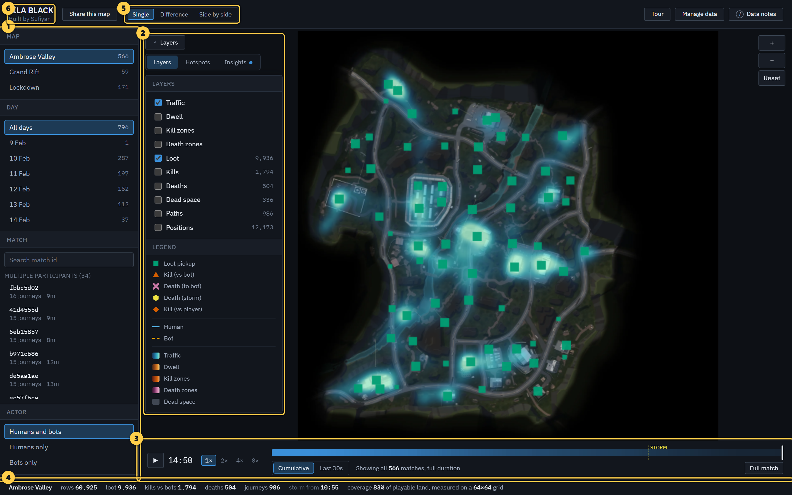

1. **Filter rail.** Map, day, match, actor and event, applied together. Every number on screen
   answers to it.
2. **Layers and analysis panel.** Toggle data layers, or switch to the ranked hotspots and the
   computed insights. It collapses to free the whole map.
3. **Timeline.** Scrub match-elapsed time, with a survivorship curve underneath.
4. **Stat strip.** A running summary of the current view, honest about what it is counting (for
   example, kills are labelled "vs bots").
5. **View mode.** Single map, a difference view, or two maps side by side.
6. **Authorship.** Built by Sufiyan, credited in the header.

## First-run tour

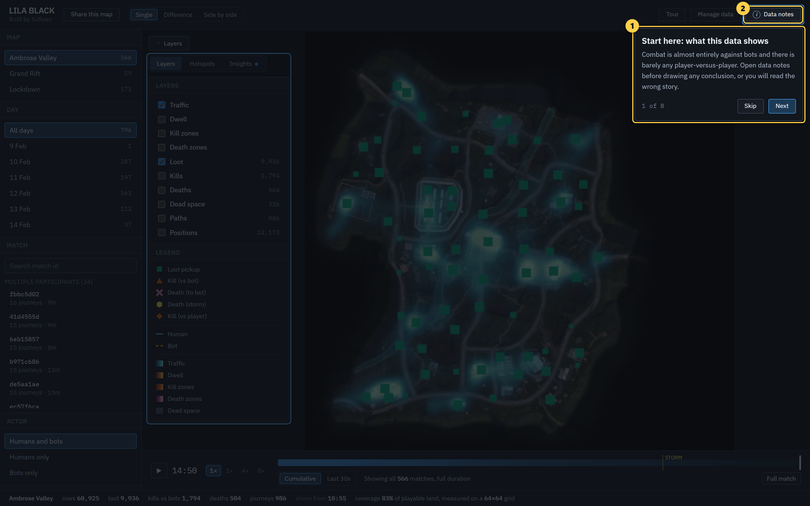

1. **Tour card.** An eight-step tour runs once on a first visit and is re-openable from the
   header. It is ordered by importance, not by layout.
2. **The honest caveat comes first.** Step one points at data notes, because the costliest
   mistake with this data is reading bot combat as player-versus-player.

## Filters

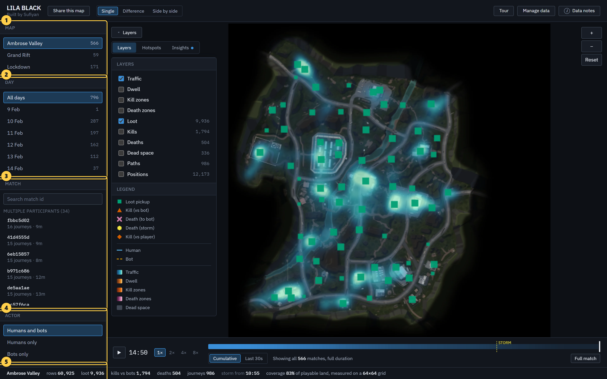

1. **Map.** Each map is a separate world with its own projection and data.
2. **Day.** Volume falls sharply across the five days, so narrowing to one changes the sample
   size a great deal.
3. **Match.** Search or pick a single match. Matches with several journeys are listed first.
4. **Actor.** Humans, bots, or both.
5. **Events.** Choose which event types to show. Turning one off does not change the counts of
   the others, so you can always tell "none happened" from "switched off".

## Layers

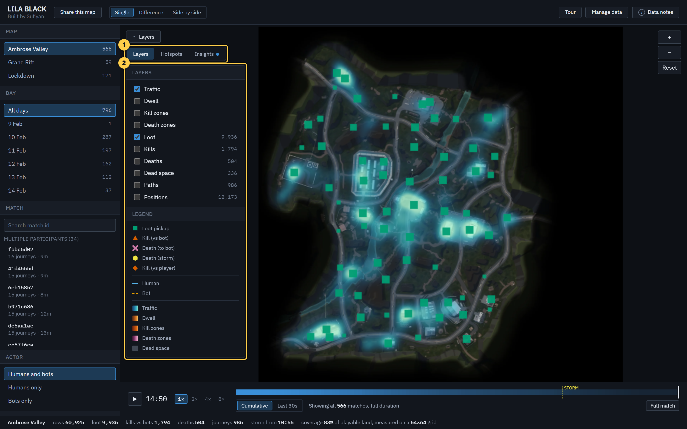

1. **Panel tabs.** Layers, the ranked hotspots, and the computed insights.
2. **Toggles and legend.** Traffic and dwell heat, kill and death density, loot, kills, deaths,
   dead space, paths and raw positions, each with a live count. The legend names every mark, so
   nothing on the map is unexplained.

## Timeline and survivorship

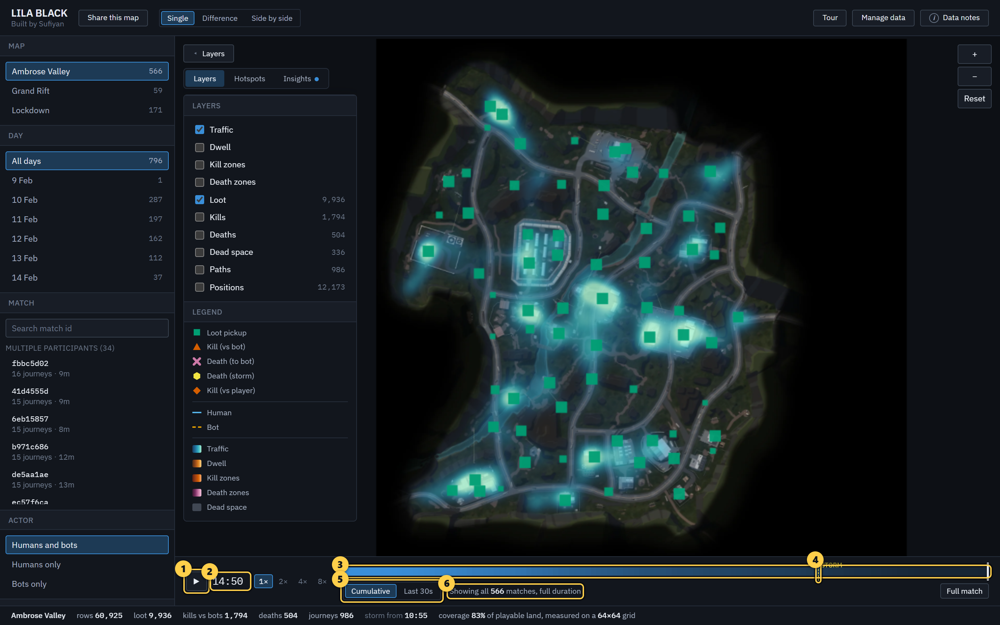

1. **Play.** Animate match-elapsed time, or press space.
2. **Clock.** The current position in the match, as minutes and seconds.
3. **Survivorship curve.** How many matches are still running at each moment.
4. **Storm marker.** When the storm can first kill, at 10:55.
5. **Time mode.** Everything up to now (cumulative), or only the last thirty seconds.
6. **Live match count.** How many matches are still running at the current moment, so a thinning
   late map reads as matches ending rather than players leaving.

## Hotspots and drill-down

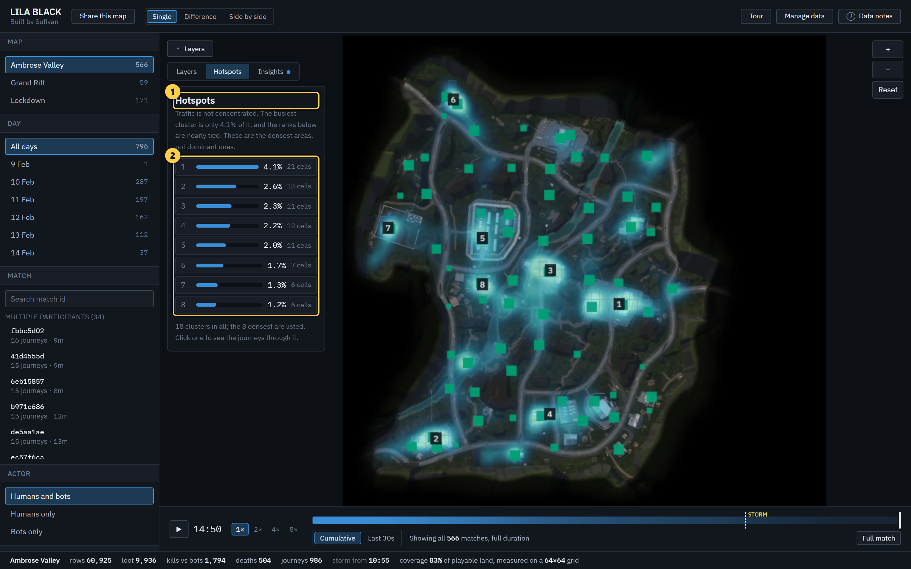

1. **What they are.** The densest areas, ranked by share of traffic. The tool is honest that
   the busiest cluster is only 4.1% of traffic and the ranks are nearly tied.
2. **Ranked list.** Each entry shows its share and its cell count, and matches a numbered cell
   on the map. Click one to see the journeys that passed through it, then click a journey to
   draw that single player's route on the map.

## Insights

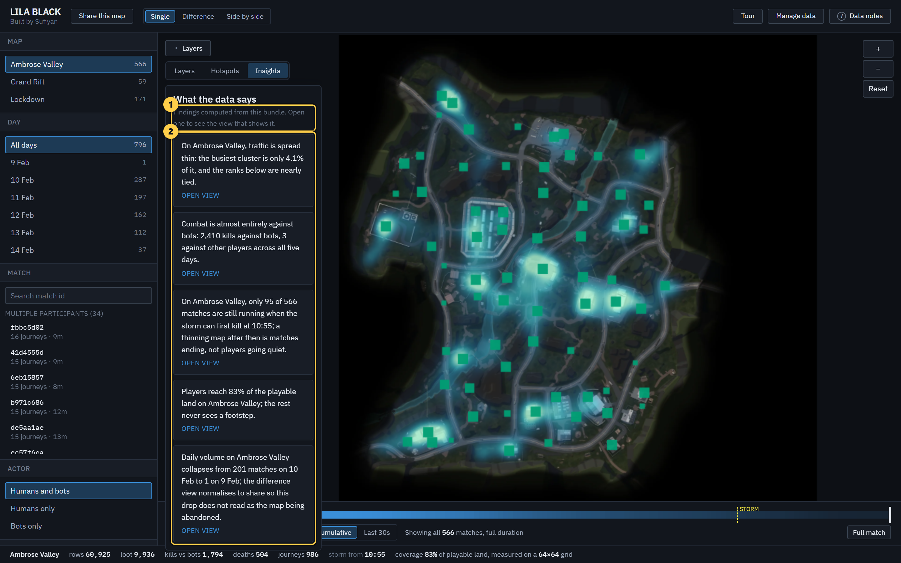

1. **Read from the data.** Each finding is computed from the bundle, not written by hand.
2. **Each opens its own view.** Click a card and the tool switches to the exact filter, layer
   and comparison that shows the finding, so the map arrives with an opinion rather than blank.

## Compare, difference view

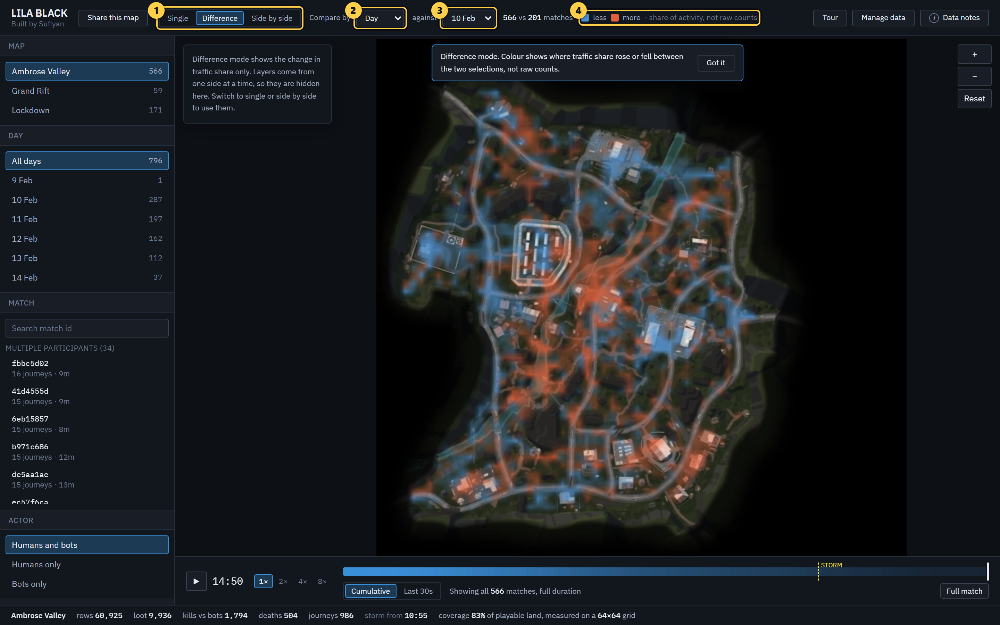

1. **Difference selected.** The map shows change, not raw counts.
2. **Compare by.** Day, in this example.
3. **Against.** The specific value on the other side, here 10 February.
4. **Legend.** Blue is less, orange is more, and the difference is measured as share of
   activity, not raw counts, so a day with fewer matches does not read as the map being
   abandoned.

## Compare, side by side

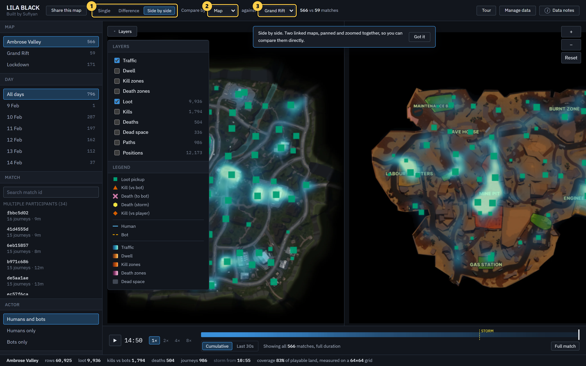

1. **Side by side selected.** Two maps in one view, panned and zoomed together.
2. **Compare by.** Map, in this example.
3. **Against.** The second map, here Grand Rift. Every layer toggle applies to both maps, so a
   real dwell, coverage or path comparison is possible, not only traffic.

## Data notes

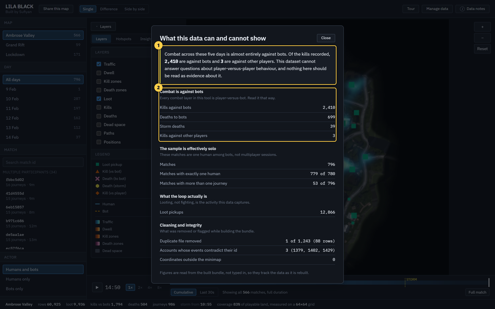

1. **The lead caveat.** Combat is almost entirely against bots: 2,410 kills against bots and 3
   against other players across five days. This dataset cannot answer player-versus-player
   questions.
2. **The figures.** Every number here is read from the built bundle, not typed in, so it tracks
   the data as it is rebuilt.

## Add your own data

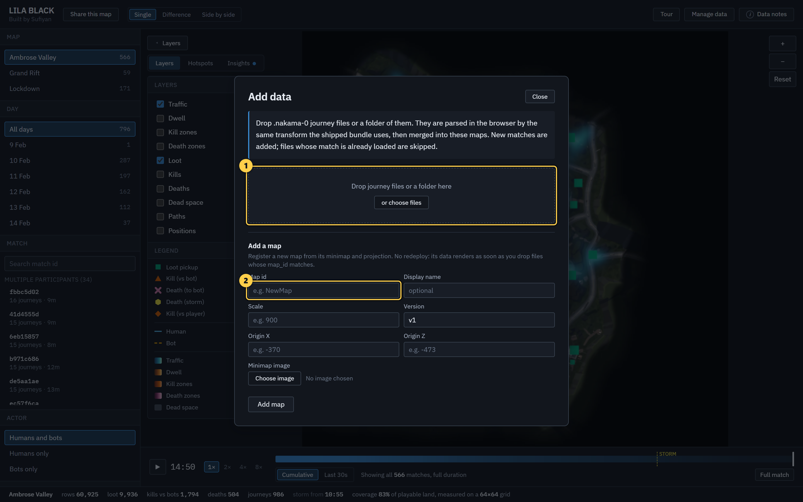

1. **Drop zone.** Drop .nakama-0 journey files or a folder of them. They are parsed in the
   browser by the same transform the shipped bundle uses, then merged into the maps.
2. **Add a map.** Register a new map from its minimap and projection, with no redeploy. Its data
   renders as soon as you drop files whose map id matches.

## Telling added data apart

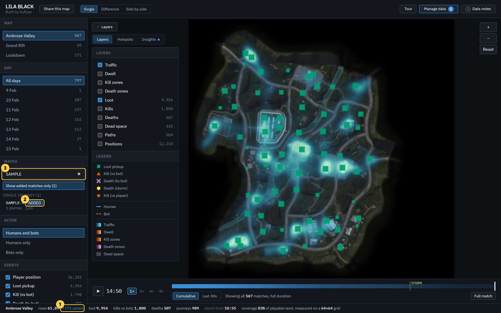

1. **Stat strip.** The current view shows how many rows came from dropped data, here plus 173.
2. **Match tag.** Matches from added data carry an "added" tag in the picker.
3. **Search and isolate.** Search a match id, or use "show added matches only" to isolate the
   telemetry you dropped in. Added data is always distinguishable from the shipped bundle.
